# E-Laundry Management System (Zira Laundry)

## 📖 Ringkasan Proyek (Project Summary)

**E-Laundry System** (diimplementasikan pada studi kasus "Zira Laundry") adalah aplikasi berbasis web yang dirancang untuk mendigitalisasi operasional UMKM laundry. Sistem ini bertujuan menggantikan pencatatan buku manual menjadi sistem komputerisasi yang terintegrasi.

Fokus utama sistem ini adalah menangani seluruh siklus bisnis laundry, mulai dari pencatatan transaksi di kasir, pemantauan proses operasional oleh petugas cuci, hingga memberikan transparansi kepada pelanggan melalui fitur pelacakan (tracking) resi secara *real-time* tanpa memerlukan login pelanggan.

Proyek ini dikembangkan menggunakan **PHP Native (Tanpa Framework)** dan **MySQL** untuk memenuhi Tugas Besar Praktikum Pemrograman Web.

### Fitur Unggulan:
* **Pelanggan (Public):** Cek status cucian via Kode Resi & melihat daftar harga terbaru.
* **Kasir (POS):** Input transaksi cepat, hitung total otomatis, dan cetak struk.
* **Petugas Cuci (Worker):** Dashboard antrean tugas dan update status pengerjaan (*Washing* -> *Ironing* -> *Done*).
* **Admin/Owner:** Manajemen data master (paket/user) dan laporan pendapatan sederhana.

---

## 👥 Anggota Kelompok (Team Members)

Kelompok: **[Kelompok 10**

Berikut adalah daftar anggota tim pengembang beserta pembagian tanggung jawab utamanya:

| NPM | Nama Lengkap | Peran (Role) & Tanggung Jawab |
| :--- | :--- | :--- |
| **2365061001** | **Ramadhani Ahmad** | **Ketua / Fullstack Admin** (Setup Database & Config, Fitur Login/Auth, CRUD Manajemen User & Paket Laundry, Dashboard Owner) |
| 2315061028 | Zahra Aulia Nafisa | **Frontend Public** (Halaman Utama/Landing Page, Tampilan Pricelist, Fitur Cek Resi Pelanggan) |
| 2315061017 | Syandra Zahira | **Backend Worker (Operasional)** (Dashboard Daftar Tugas Cucian, Fitur Update Status Pengerjaan) |
| 2315061008 | Andi Muhammad Daffa Ramadhan | **Backend Cashier (Transaksi)** (Form Input Transaksi Baru, Fitur Pelunasan & Pengambilan Barang, Halaman Cetak Struk) |

---

## 🛠️ Teknologi yang Digunakan (Tech Stack)
* **Bahasa Pemrograman:** PHP (Native/Procedural version 8.x)
* **Database:** MySQL (MariaDB)
* **Frontend:** HTML5, CSS3 (Vanilla), Sedikit JavaScript
* **Server Lokal:** Laragon (Apache Web Server)
* **Version Control:** Git & GitHub

---

## 🚀 Cara Menjalankan Aplikasi (Installation Guide)

Ikuti langkah-langkah berikut untuk menjalankan proyek ini di komputer lokal (Localhost):

### 1. Persiapan Lingkungan (Environment)
Pastikan Anda sudah menginstal aplikasi web server lokal seperti **XAMPP** atau **Laragon**, dan pastikan layanan **Apache** dan **MySQL** sudah berjalan.

### 2. Clone Repository
Buka terminal (Git Bash/CMD), arahkan ke folder `htdocs` (jika pakai XAMPP) atau `www` (jika pakai Laragon). Lalu clone repository ini:

bash
cd C:\xampp\htdocs\
git clone [Tulis URL Repository GitHub Anda Disini]

---

## 📸 Galeri Antarmuka Aplikasi (Screenshots Gallery)

Berikut adalah dokumentasi visual lengkap dari seluruh halaman yang tersedia dalam Sistem E-Laundry Zahra, dikelompokkan berdasarkan hak akses pengguna.

### A. Akses Publik & Autentikasi
Halaman yang dapat diakses oleh pelanggan umum dan pintu masuk bagi pegawai.

**1. Halaman Utama (Landing Page)**
Beranda yang menampilkan informasi laundry dan daftar harga paket.
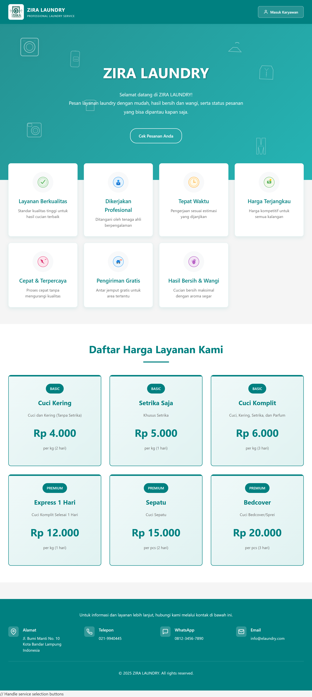

**2. Hasil Cek Resi (Tracking)**
Tampilan status terkini cucian setelah pelanggan memasukkan kode resi.
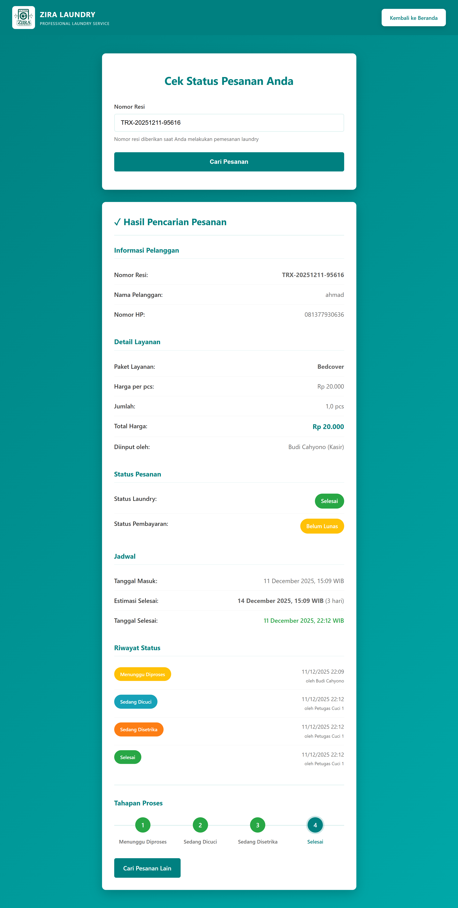

**3. Login Pegawai**
Halaman autentikasi khusus untuk Admin, Kasir, dan Petugas Cuci.
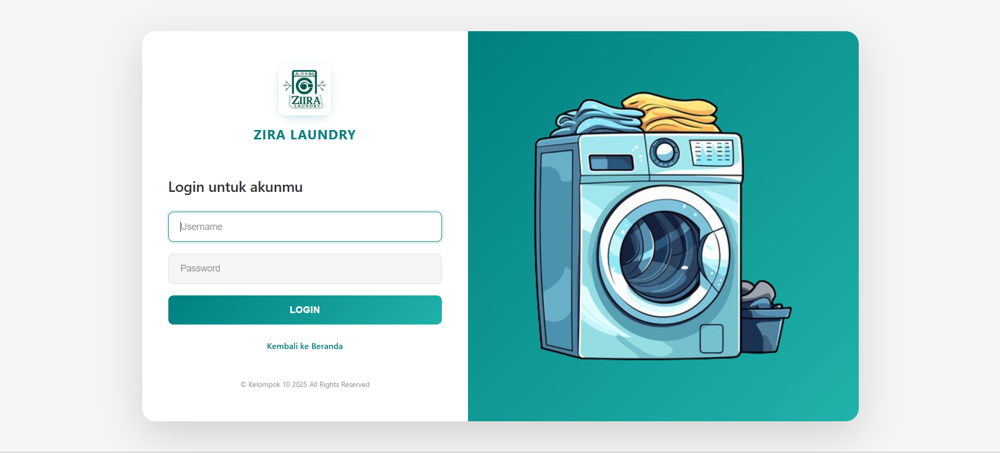

---

### B. Halaman Admin (Owner)
Area pusat kontrol untuk manajemen data master dan pemantauan bisnis.

**1. Dashboard Admin**
Ringkasan statistik data laundry.
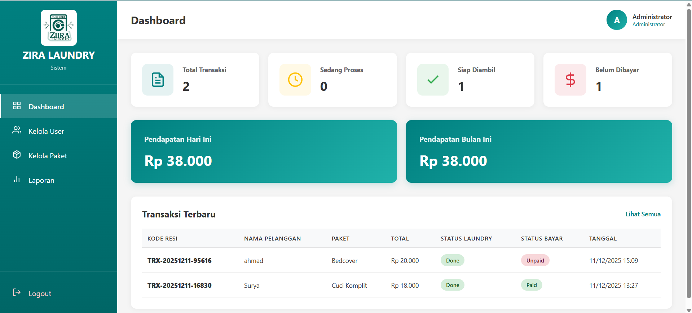

**2. Kelola Pengguna (User Management)**
Halaman untuk menambah, mengedit, atau menghapus akun pegawai.
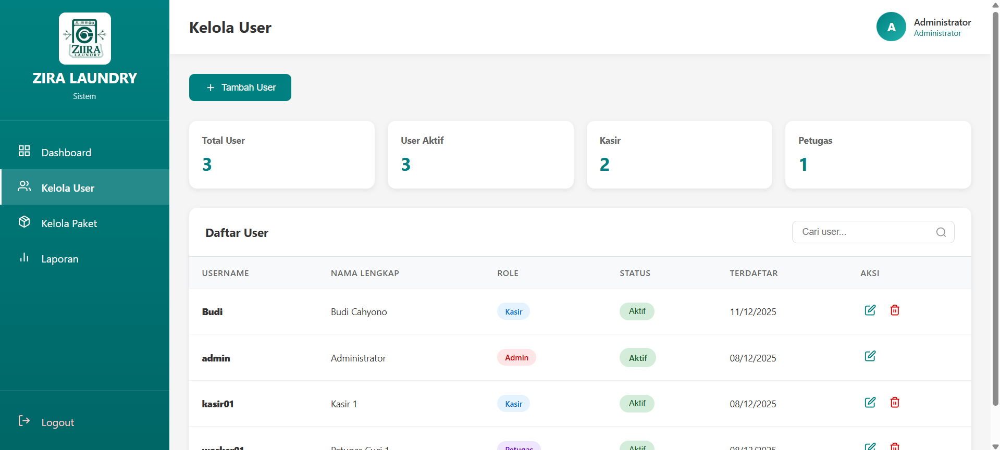

**3. Kelola Paket Laundry**
Halaman untuk mengatur nama paket, harga, dan satuan layanan.
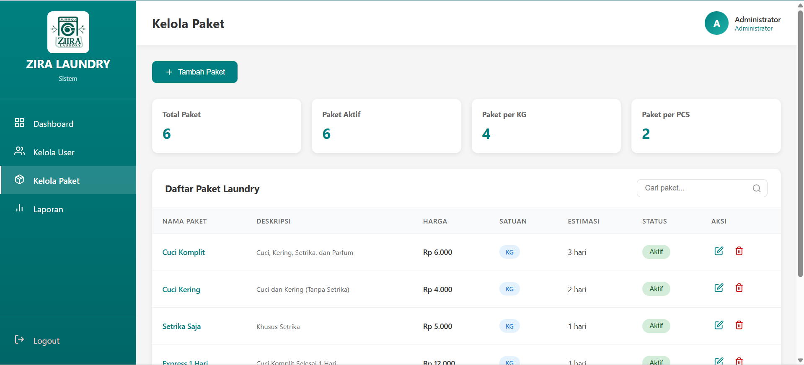

**4. Laporan Pendapatan**
Halaman rekapitulasi transaksi dan pendapatan.
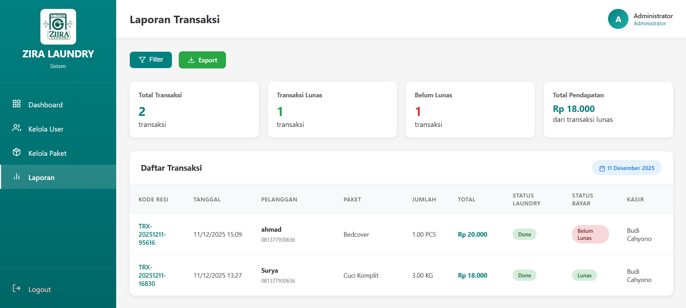

---

### C. Halaman Kasir (Point of Sale)
Area kerja kasir untuk menangani transaksi masuk dan keluar.

**1. Input Transaksi Baru**
Formulir untuk menerima cucian masuk dari pelanggan.
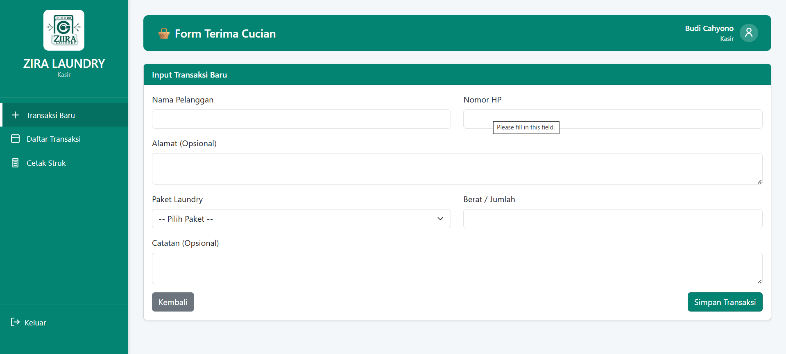

**2. Daftar Transaksi & Pengambilan**
Tabel untuk memantau status bayar dan memproses pengambilan barang.
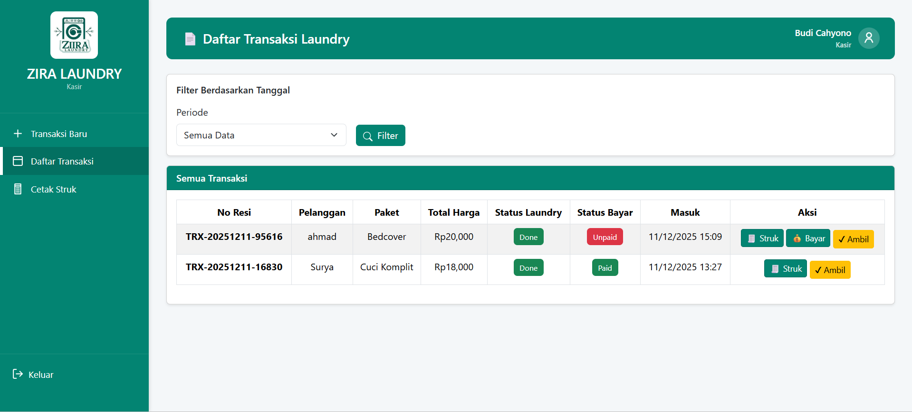

**3. Cetak Struk (Invoice)**
Tampilan nota digital yang siap dicetak untuk pelanggan.
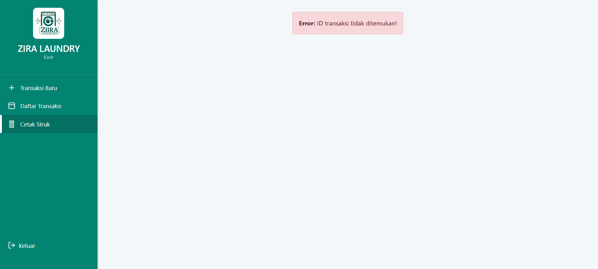

---

### D. Halaman Petugas Cuci (Worker)
Area operasional untuk memperbarui status pengerjaan cucian.

**1. Daftar Tugas Aktif (Task List)**
Antrean cucian yang harus segera diproses (Cuci/Setrika).
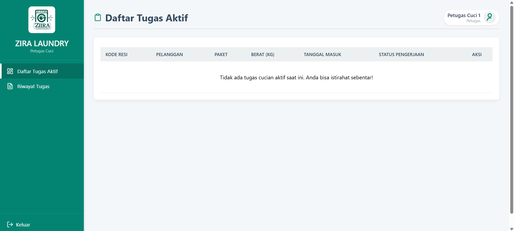

**2. Riwayat Pengerjaan**
Daftar cucian yang telah selesai dikerjakan oleh petugas tersebut.
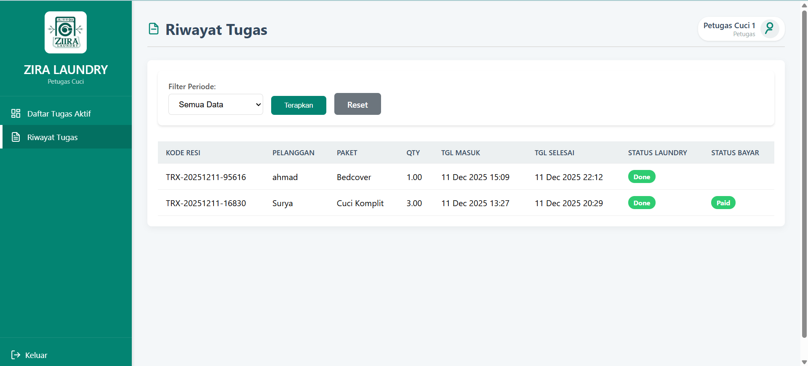

---
